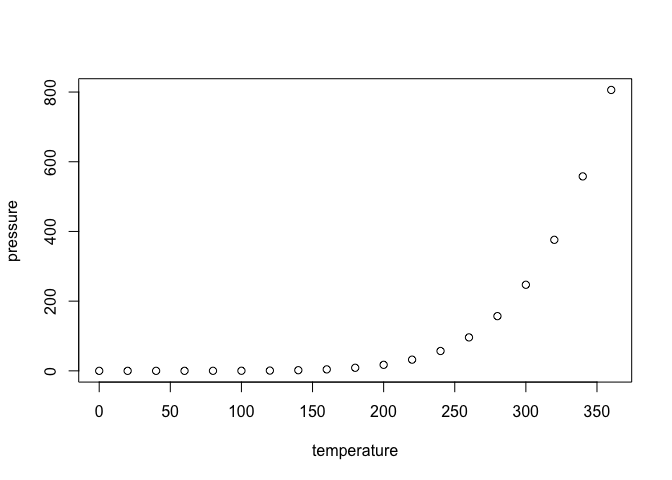

<!-- README.md is generated from README.Rmd. Please edit that file -->
MomX
----

[](https://www.tidyverse.org/lifecycle/#experimental) [](https://travis-ci.org/MomX/MomX) [](https://cran.r-project.org/package=MomX)

MomX packages are an ecosystem of packages for everything 2D morphometrics, that is the statistical description of shape and its (co)variation. This is (very largely) inspired by the [tidyverse](https://tidyverse.org)

MomX packages share common principles and work together well. This eponymous package is designed to make it easy to install and load core MomX packages in a single step.

Besides MomX itself, these packages are currently in development:

-   **Momocs**: the mothership of MomX, complete 2D morphometrics toolbox from shapes and collections of shapes.
-   **Momacs**: acquisition of morphometrics data
-   **Momecs**: multivariate analyses for morphometrics data
-   **Momit**: morphometrics data conversion and exchange
-   **Momfarm**: breeding shapes

\_\_

Installation
------------

### Installation

The (future) released version will be installable from [CRAN](https://CRAN.R-project.org/package=MomX) with:

``` r
install.packages("MomX")
```

But I recommend using the development version from GitHub with:

``` r
# install.packages("devtools")
devtools::install_github("MomX/MomX")
```

Then, all MomX packages will be loadable with a single call to:

``` r
library(MomX)
```

and installable/updatable with :

``` r
MomX_update()
MomX_dev()
```

<!--
### Example

This is a basic example which shows you how to solve a common problem:


```r
## basic example code
```

What is special about using `README.Rmd` instead of just `README.md`? You can include R chunks like so:


```r
summary(cars)
#>      speed           dist       
#>  Min.   : 4.0   Min.   :  2.00  
#>  1st Qu.:12.0   1st Qu.: 26.00  
#>  Median :15.0   Median : 36.00  
#>  Mean   :15.4   Mean   : 42.98  
#>  3rd Qu.:19.0   3rd Qu.: 56.00  
#>  Max.   :25.0   Max.   :120.00
```

You'll still need to render `README.Rmd` regularly, to keep `README.md` up-to-date.

You can also embed plots, for example:



In that case, don't forget to commit and push the resulting figure files, so they display on GitHub!
-->
